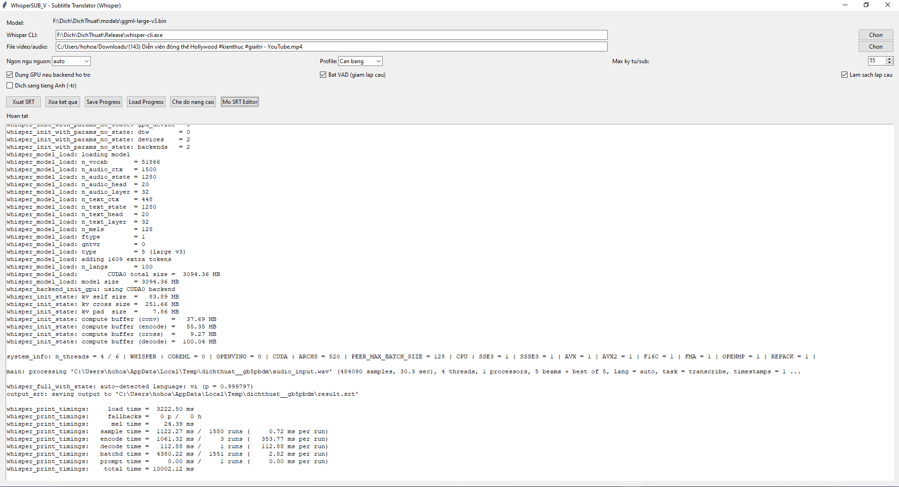
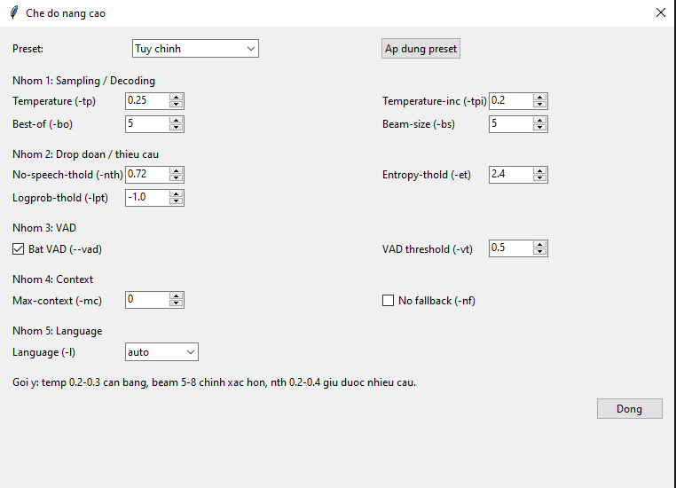

# WhisperSUB_V

WhisperSUB_V là phần mềm tạo phụ đề `.srt` từ video/audio bằng `whisper.cpp`, có giao diện chỉnh SRT và công cụ tải thành phần còn thiếu.

## Yêu cầu hệ thống
- **Windows 10/11 64-bit** (Windows-only)
- **Python 3.9+**
- **RAM tối thiểu: 8GB** (khuyên dùng 16GB khi dùng model large-v3)
- **GPU (tuỳ chọn)**: nếu có bản `whisper-cli.exe` build hỗ trợ CUDA/OpenVINO thì app dùng GPU được

## Thành phần bắt buộc để app chạy
Đặt đúng file vào đúng thư mục:

```text
WhisperSUB_V/
├─ WhisperSUB_V.py
├─ WhisperSUB_V.spec
├─ requirements.txt
├─ README.md
├─ models/
│  └─ ggml-large-v3.bin
├─ Release/
│  ├─ whisper-cli.exe
│  ├─ ffmpeg.exe
│  ├─ mpv.exe
│  └─ silero_vad.bin / silero_v5.1.2.bin / silero_vad.onnx
├─ logs/
│  └─ app.log                # tự tạo khi chạy
└─ docs/images/              # ảnh minh hoạ (tuỳ chọn)
```

## Link tải chính thức
- whisper.cpp releases: https://github.com/ggml-org/whisper.cpp/releases
- Model `ggml-large-v3.bin`: https://huggingface.co/ggerganov/whisper.cpp/resolve/main/ggml-large-v3.bin?download=true
- FFmpeg download: https://www.ffmpeg.org/download.html
- MPV releases: https://github.com/mpv-player/mpv/releases
- Whisper VAD model (`silero_v5.1.2.bin`): https://huggingface.co/ggml-org/whisper-vad/resolve/main/silero_v5.1.2.bin?download=true
- Silero VAD repo: https://github.com/snakers4/silero-vad

## Hướng dẫn người dùng phổ thông
1. Tải source hoặc bản portable của WhisperSUB_V.
2. Tải `whisper.cpp` bản **Windows x64** từ trang release ở trên.
3. Trong gói release whisper.cpp, lấy file **`whisper-cli.exe`** và chép vào `Release/`.
   - Một số bản cũ có `main.exe`; app vẫn nhận, nhưng bạn nên dùng `whisper-cli.exe`.
4. Chạy app:
```powershell
python WhisperSUB_V.py
```
5. Nếu thiếu file, bấm nút **`Tai file thieu`** trong app để dán URL và tải tự động.
6. Chọn media rồi bấm `Xuat SRT`.

## Tính năng
- Xuất `.srt` từ nhiều định dạng media.
- Hỗ trợ GPU/CPU.
- VAD giảm lặp câu.
- SRT Editor tích hợp (sửa text/timeline, thêm/xóa dòng).
- Advanced mode + preset ngôn ngữ.
- Nút `Tai file thieu` để tải nhanh thành phần còn thiếu.


## Screenshot



## Logging
- App ghi log ra: **`logs/app.log`**
- Khi lỗi, bạn có thể gửi file log này để debug nhanh.

## Versioning
- Version hiện tại được khai báo trong code: `APP_VERSION = "1.0.0"`
- Version hiển thị ngay trên title của cửa sổ app.

## Build EXE
```powershell
pyinstaller --noconfirm --clean WhisperSUB_V.spec
```
Output: `dist/WhisperSUB_V/WhisperSUB_V.exe`

---

# English

WhisperSUB_V is a Windows desktop app that generates `.srt` subtitles from video/audio using `whisper.cpp`, with a built-in subtitle editor.

## System Requirements
- **Windows 10/11 64-bit** (Windows-only)
- **Python 3.9+**
- **Minimum RAM: 8GB** (16GB recommended for large-v3)
- **Optional GPU** (requires a GPU-enabled `whisper-cli.exe` build)

## Required files/folders
```text
WhisperSUB_V/
├─ WhisperSUB_V.py
├─ WhisperSUB_V.spec
├─ requirements.txt
├─ models/ggml-large-v3.bin
├─ Release/whisper-cli.exe
├─ Release/ffmpeg.exe
├─ Release/mpv.exe
└─ Release/silero_vad.bin (or silero_v5.1.2.bin / silero_vad.onnx)
```

## Quick setup
1. Download whisper.cpp **Windows x64** release.
2. Copy `whisper-cli.exe` to `Release/`.
3. Run:
```powershell
python WhisperSUB_V.py
```
4. Use `Tai file thieu` inside the app if components are missing.


## Screenshot


## Logging
- Runtime logs are written to `logs/app.log`.

## Build EXE
```powershell
pyinstaller --noconfirm --clean WhisperSUB_V.spec
```

